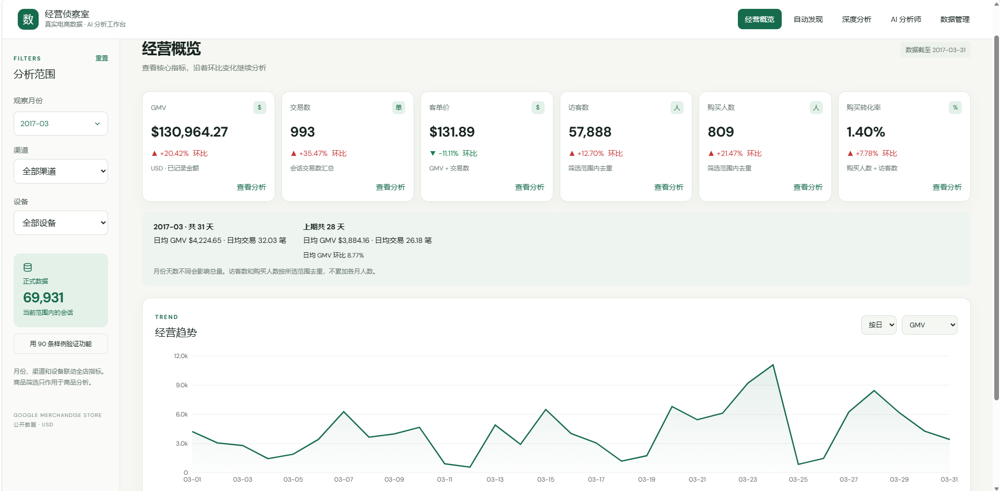
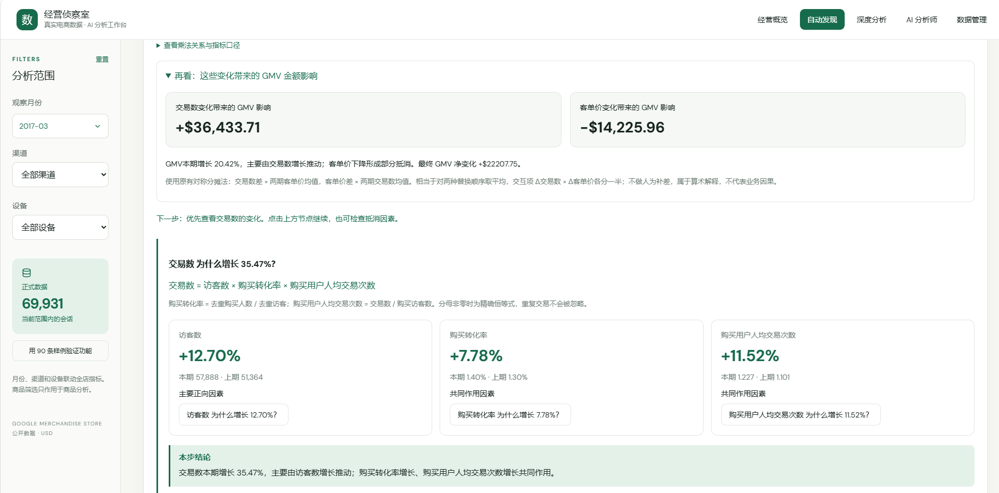

# 经营数据智能诊断平台

**Business Analytics Diagnostic Platform · 数据分析求职作品**

### [🌐 在线体验](https://data-practice-lab-0922.yue1049988042.chatgpt.site/#overview) | [📖 项目说明](#1-项目简介)

## 1. 项目简介

GMV 上涨，究竟是交易更多，还是客单价更高？这个项目将“发现变化 → 指标拆解 → 驱动定位 → 维度下钻 → 行为诊断 → 分析结论”串成可交互的分析流程，让读者从经营指标一路追问到变化线索。

面向数据分析、经营分析、商业分析岗位，展示从业务问题出发建立指标体系、用 SQL 聚合统一口径、量化推动与抵消因素，并清楚表达结论边界的能力。每步结论由结构化计算结果和模板生成。

## 2. 核心界面截图

**经营概览：从核心指标的环比变化进入分析。**

**推荐体验路径：** 2017-03 → GMV 查看分析 → 交易数 → 访客数 → 渠道/设备维度下钻。



截图为历史线上版本，保留原界面名称；其中 AI、数据管理入口不代表当前公开版已启用。[查看完整界面截图](docs/images/README.md)。

## 3. 真实分析案例 / Case Study

### GMV 增长 20.42%，主要由什么推动？

**2017-03 vs 2017-02 · 全渠道、全设备 · 美元**

```text
GMV +20.42%
  → 交易数 +35.47% / 客单价 -11.11%
  → 继续拆解交易数
  → 访客 +12.70%、转化率 +7.78%、人均交易次数 +11.52%
```

| GMV 变化的组成 | 金额影响 |
|---|---:|
| **交易数推动** | **+$36,433.71** |
| **客单价抵消** | **-$14,225.96** |
| **GMV 净增** | **+$22,207.75** |

> **分析结论：交易数增长是 GMV 上升的主要驱动，访客增长在交易数拆解中贡献最大，转化率和购买用户人均交易次数提升共同推动；客单价下降抵消了部分增长。**



这里的“人均交易次数”指购买用户人均交易次数，不是复购率；转化率 +7.78% 是相对增幅，不是增加 7.78 个百分点。3 月 31 天、2 月 28 天，总量变化包含天数差异。

案例依据已核验的生效导入汇总快照，并由当前算法复算；金额表示数学分配影响，不代表项目创造的业务收益。案例停在指标驱动层，未核验真实渠道/设备接口排名。[两期完整数据、贡献明细与核验过程](docs/real-case.md)。

## 4. 解决的问题

- **区分增长来源：** 将 GMV 变化拆成交易规模与客单价影响，再追问访客、转化和交易频次。
- **量化推动与抵消：** 用金额或数量影响比较因素，避免把涨幅最大当作贡献最大。
- **定位变化范围：** 允许按渠道、设备自由选择下钻顺序，继承筛选范围。
- **形成可解释结论：** 每步数据后呈现对应范围的结论，区分数学贡献、分组变化与行为线索。

## 5. 分析方法

### 指标体系 / Metric Tree

```text
GMV = 交易数 × 客单价
交易数 = 访客数 × 购买转化率 × 购买用户人均交易次数
购买人数 = 访客数 × 购买转化率
```

| 指标 | 口径 | 聚合性质 |
|---|---|---|
| GMV | 会话 transactionRevenue 汇总 / 1,000,000，美元 | additive |
| 交易数 | 会话 totals.transactions 汇总 | additive |
| 访客数 | 整个筛选范围内 fullVisitorId 去重 | distinct |
| 购买人数 | transactions > 0 的访客去重 | distinct |
| 购买转化率 | 购买人数 / 访客数 | ratio |
| 客单价 | GMV / 交易数 | ratio |
| 购买用户人均交易次数 | 交易数 / 购买人数 | ratio |

分母为零时返回不可计算状态；多日、多月 UV 不能由每日访客相加。

### Shapley：将变化分配给驱动因素

GMV 两因素分解对两种变化顺序取平均：交易数影响 = Δ交易数 × 两期平均客单价，客单价影响 = Δ客单价 × 两期平均交易数，各分得一半交互项。

交易数三因素枚举 6 种变化顺序，平均边际影响，再乘两期平均客单价映射为 GMV 影响。这是**分层 Shapley（Owen-style 分组分配）**，不是平铺四因素 Shapley。

计算使用未格式化值，最后展示时舍入；检查顶层影响之和等于 ΔGMV、三因素数量影响之和等于 Δ交易数、三因素金额影响之和等于交易分支 GMV 影响。数学贡献不等于业务因果。

### 维度下钻：保持 scope 与去重边界

渠道和设备是可切换的观察维度，不是固定父子树。下钻继承全局筛选，将所选分组加入 **scope**；结论必须说明范围，不能将某渠道内的发现扩大为全店。

- **additive：** GMV、交易数检查分组守恒。
- **distinct：** 分组访客可能重叠，使用“分组变化”，不能相加为整体精确贡献。
- **ratio：** 查看分子、分母，不相加分组比例。

维度推荐结合变化规模、集中程度、正负抵消及样本质量，决定探索优先级；评分不是统计显著性检验。[接口示例与详细 scope 规则](docs/technical-reference.md)。

### 行为诊断：提供进一步调查的线索

在适用分支比较浏览、加购、结账、购买的同会话交集率，以百分点变化定位线索。行为诊断不是每条路径的必经步骤，也不保证完整顺序，不能连乘解释购买转化率或证明因果。

另有“同会话、同商品、加购早于购买”的有序口径，也不是跨会话用户漏斗。[口径与实现边界](docs/analysis-foundation.md)。

## 6. 数据来源与规模

原项目数据说明指向 BigQuery `google_analytics_sample`；Google 的 [UA 样例说明](https://support.google.com/analytics/answer/7586738?hl=en)描述其来自经过混淆处理的 Google Merchandise Store 数据。当前字段是 UA 会话结构，不是 GA4 events 表。

线上生效报告覆盖 2017 年 1—3 月：分别为 64,694、62,192、69,931 条会话，共 **196,817 条会话、871,268 条 hits**。月 UV 不相加为跨月独立用户量。

未找到原始导出 SQL、下载凭证和再分发授权记录，不能只凭字段证明每条记录来源。项目不分发原始 GA 会话，保留汇总核验结果；本地 `lib/sample.json` 为 **236 条带 SYNTHETIC 标识的人工合成会话**，用于功能演示，不重现历史金额。

## 7. 技术实现与验证

React / TypeScript 展示，Vinext / Vite 构建，Cloudflare Worker 执行 API，D1 存储会话和商品，R2 存储原文件，Drizzle 管理表结构及迁移。服务端统一聚合与计算，页面消费结果并呈现分析结论。

已记录的验证覆盖守恒、反向变化、零分母、distinct 重叠、双向下钻、scope 冲突及结论边界。SQLite 合成测试不等于生产全量回归。

- [测试结果与核验范围](docs/validation-results.md)
- [声明与证据对应表](docs/claims-verification.md)
- [技术参考：接口、架构、测试命令与历史模块边界](docs/technical-reference.md)

## 8. 本地体验

使用 Node 22.15+（建议 Node 24）及 package.json 指定的 pnpm，无需真实 API Key。本地演示使用合成数据。[安装、初始化与运行步骤](docs/technical-reference.md#13-本地运行方法)。

完整后端依赖 Cloudflare 平台适配，不能直接上传 GitHub Pages 运行。

## 9. 项目局限与后续方向

- 数学归因、维度定位、行为线索不等于业务因果；没有真实业务收益验证。
- 当前可靠维度只有渠道、设备；不宣称支持地区、新老用户或完整 Tableau。
- 样本门槛与评分为启发式，不是统计显著性检验。
- 缺少价格、成本、营销活动等信息，不能判断利润或促销效果。
- 真实维度案例的接口证据、目标网络访问与生产冷查询性能仍待补齐；已有界面截图不能替代这些核验。
- 当前公开版不提供 AI 报告、历史报告保存或导出。
- 第三方许可文件保留；发布前需确认自有代码许可，尚未选择开源许可证。

后续优先完善真实维度案例、数据获取说明和可复现性能测量。
