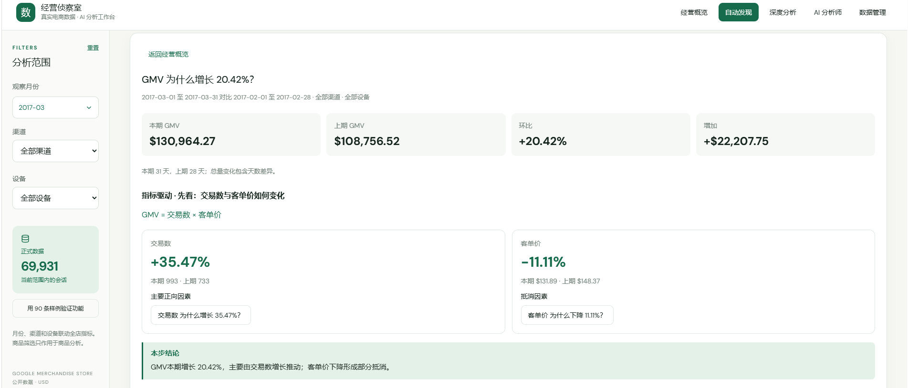
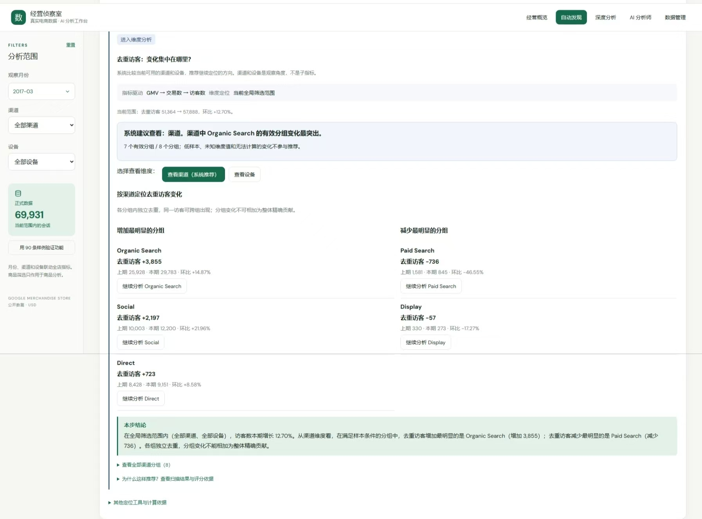
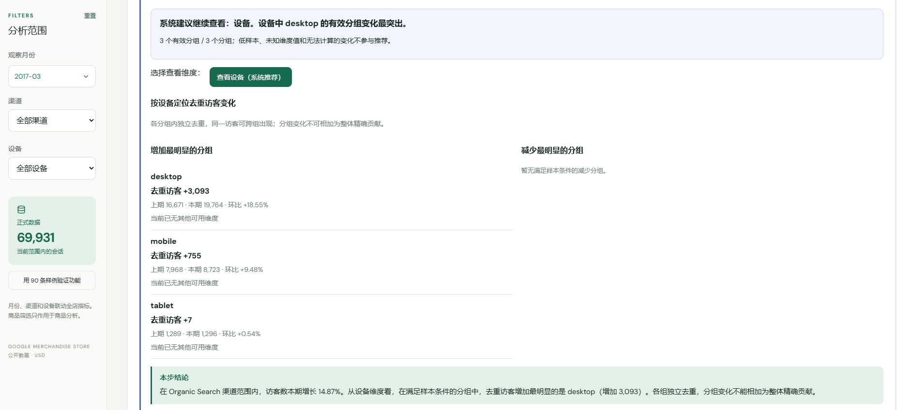
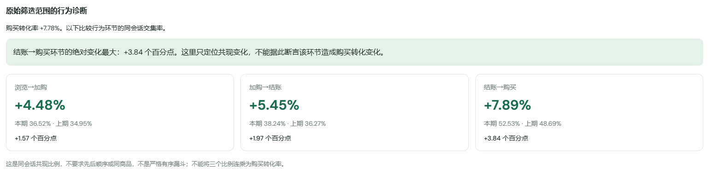

# 实际截图清单

此目录已有六张界面截图，以下均按“历史线上版本”展示，保留原界面名称和数字。图片中的 AI、数据管理入口不代表当前公开版可用功能。截图用于展示界面流程，不替代接口响应核验；渠道、设备与行为画面不作为本轮新增经营结论。

## 截图浏览

### 经营概览 · 历史线上版本

### GMV 拆解 · 历史线上版本

### 交易数拆解 · 历史线上版本

### 维度定位 · 历史线上版本

### 带 scope 的下钻 · 历史线上版本

### 行为诊断 · 历史线上版本

## 原截图操作清单

| 文件名 | 操作 | 必須保留 |
|---|---|---|
| 01-overview.png | 真实站选 2017-03、全部渠道、全部设备 | 月份、筛选、KPI |
| 02-gmv-decomposition.png | GMV 查看分析 | 两子指标、金额、本步结论 |
| 03-transactions.png | 展开交易数 | 访客/转化/频次及结论 |
| 04-dimension.jpg | 展开访客，查看推荐或选择渠道 | 维度、真实分组、范围 |
| 05-scoped-drilldown.png | 选一个真实渠道，继续设备分析 | 渠道 scope、设备结果和结论 |
| 06-behavior.png | 回到购买转化率分支，展开行为诊断 | 分母、百分点、口径限制 |

后续补充截图时，隐藏个人邮箱、令牌、后台原文件及浏览器个人信息，不改分析数字。本地截图必须标“合成数据”，不得当作历史真实案例。
